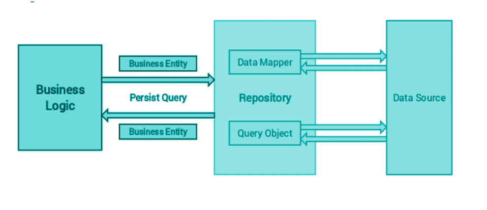

# 3. `How` to implement Repository Pattern

### What is a Repository ?

A Repository mediates between the `domain and data mapping layer`s, acting like `an in-memory domain object collection`. Client objects construct query specifications declaratively and submit them to Repository for satisfaction. `Objects can be added to and removed from the Repository`, as they can from a simple collection of objects, and `the mapping code encapsulated by the Repository will carry out the appropriate operations behind the scenes`.”



- **Repository pattern separates the `data access logic and maps it to the business entities in the business logic`. Communication between the data access logic and the business logic is done through interfaces.**

**Repository pattern is a kind of `container where data access logic is stored. It hides the details of data access logic from business logic`. In other words, we allow business logic to access the data object without having knowledge of underlying data access architecture.**

- Repository design pattern is `fully stick onto interfaces`.
- An interface acts like a **contract which specify what an concrete class must implement.**
  - **Let’s say we have 2 data objects user and product.**
    - **Get all records**
    - **Create a new record**
    - **Update a record**
    - **Delete a record**

## Implementing Repository Pattern in Node.js and TypeScript :

### 1. Defining the Repository Interface

- Create an interface that outlines the basic CRUD (Create, Read, Update, Delete)

  - `get()`
  - `create()`
  - `update()`
  - `delete()`

- We have a dummy database :

  ```js
  // user.data.ts
  import { User } from "../user.type.ts";

  export const users: User[] = [
    {
      id: 1,
      name: "abc",
    },
    {
      id: 2,
      name: "xyz",
    },
  ];
  ```

- `IUserRepository.ts`

  ```ts
  // UserRepository Interface
  import { User } from "../user.type.ts";

  export interface IUserRepository {
    get(): Function;
    create(user: User): Function;
    update(user: User): Function;
    remove(id: number): Function;
  }
  ```

### 2. Implementing the Repository

Now, implement the repository for the User entity:

```ts
// UserRepository.ts

import { IUserRepository } from "./IUserRepository";
import { User } from "../user.type.ts";
import { users } from "../user.data.ts"; // dummy DB - users array

export class UserRepository implements IUserRepository {
  private users: User[];

  constructor(users: User[]) {
    this.users = users;
  }

  get(){
    return this.users;
  };

  create(user: User): {
    users.push(user);
    return `USER CREATED : ${user}`
  };

  update(
    user: User
  ): {
    // Implementation to update a user in the database
    const UserIndx = users.findIndex((u) => u.id === user.id);
    if (UserIndx === -1) {
        return 'USER_NOT_FOUND';
    }

    userData[UserIndx] = user;
    return `USER UPDATED : ${user}`
  };

  remove(id: number): {
    // Implementation to delete a user from the database
    const UserIndx = userData.findIndex((u) => u.id === userId);
    if (UserIndx === -1) {
        return 'USER_NOT_FOUND';
    }
    userData.slice(UserIndx, 1)
    return 'USER_DELETED';
  };
}
```

### 3. Using the Repository in Your Application

In our application, we can now use the UserRepository without worrying about the underlying data storage details:

```ts
// App.ts

import { UserRepository } from "./UserRepository";
import { User } from "./user.types.ts";
import { users } from "./user.data.ts";

const userRepository = new UserRepository(users);

const user = userRepository.create({
  id: "1",
  name: "John Doe",
});

console.log(response);

const usersInDB = userRepository.get();

console.log("All users:", userInDB);
```
